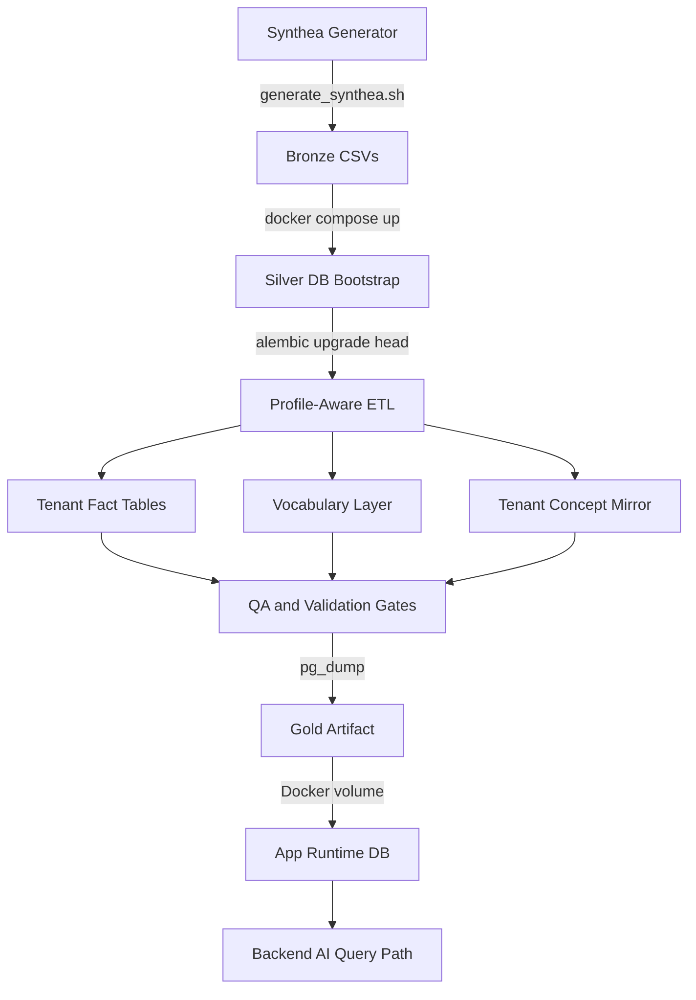

# Mediquery Data Pipeline (OMOP v5.4 & Synthea)

This directory contains the Python-based data engineering toolchain for generating highly complex enterprise-grade OMOP CDM (Observational Medical Outcomes Partnership Common Data Model) v5.4 test data using Synthea.

## Architecture (Medallion)
- **Bronze**: Raw `.csv` files generated by Synthea in `bronze/synthea/csv/`.
- **Silver**: A transient PostgreSQL 18 container dynamically provisioned via `docker-compose.yml`. Schema deployment is managed by **Alembic**, creating tenant schemas (e.g., `tenant_nexus_health`) and `omop_vocab`.
- **Gold**: ETL extraction (`load_omop.py`) of normalized tenant schemas into `gold_omop_tenant.sql` dumps, which are securely deployed into the main Mediquery App's database via Docker volumes.

## End-to-End Data Flow



## Setup
1. Ensure the root `.env` file is present and configured (`PIPELINE_DB_*`, `PIPELINE_PROFILE`, `SYNTHEA_*`).
2. Install Python dependencies once: `uv sync`
3. Run the full pipeline with a single command (no env var injection needed):

  ```bash
  uv run pipeline-full
  ```

### What `uv run pipeline-full` does

The command is fully `.env`-driven and runs all phases in order:

1. Starts PostgreSQL container (`docker compose up -d postgres`) when `PIPELINE_DB_HOST=localhost`
2. Waits for DB readiness using `PIPELINE_DB_HOST/PORT/USER/PASSWORD/NAME`
3. Generates Bronze Synthea CSVs using `SYNTHEA_POPULATION_SIZE` and `SYNTHEA_SEED`
4. Applies Silver schema migrations (`alembic upgrade head`)
5. Runs profile-aware ETL and vocabulary loading
6. Exports fresh Gold artifact to `data-pipeline/gold_omop_tenant.sql`

For ETL-only reruns (skip Synthea/migrations/export), use:

```bash
uv run pipeline-etl
```

## Pipeline Profiles (Phase 0/1)

The pipeline is profile-aware and defaults to open/synthetic-only mode:

- `PIPELINE_PROFILE=synthetic_open` (default)
  - No paid/proprietary vocabulary dependency.
  - Auto-populates required baseline OMOP concepts and vocabulary support tables used by joins and QA.
  - Enforces vocabulary quality checks; can fail fast with `FAIL_ON_VOCAB_GAP=true`.

- `PIPELINE_PROFILE=athena_permitted`
  - Placeholder profile only.
  - Disabled by default with `ATHENA_PROFILE_ENABLED=false`.
  - Not required for baseline operation.

### Key Environment Variables

- `PIPELINE_PROFILE`
- `ATHENA_PROFILE_ENABLED`
- `VOCAB_BUNDLE_PATH`
- `FAIL_ON_VOCAB_GAP`
- `SYNTHEA_POPULATION_SIZE`
- `SYNTHEA_SEED`

## Current ETL Guarantees (synthetic_open)

On each ETL run, vocabulary loading is automated and deterministic:

- Builds synthetic concepts from Synthea source events.
- Merges required baseline OMOP concepts used by mapped fact tables.
- Populates `omop_vocab` support tables required for reliable joins:
  - `concept`
  - `vocabulary`
  - `domain`
  - `relationship`
  - `concept_relationship`
  - `concept_synonym`
- Synchronizes tenant-local `concept` table for compatibility checks.

No manual SQL patching should be required between runs.

## Design Documents

Detailed architecture rationale and design decisions live in [`docs/humans/designs/`](../docs/humans/designs/). The docs are grouped below by concern area.

### Data Pipeline & Storage

| Document | What it covers |
|---|---|
| [Data Ingestion & ETL Architecture](../docs/humans/designs/data_ingestion_etl_architecture.md) | How Synthea CSVs become OMOP-compliant fact tables — full Medallion walkthrough, load order, and column-level mapping decisions |
| [Schema Per Tenant Rationale](../docs/humans/designs/schema_per_tenant_rationale.md) | Why each tenant gets its own PostgreSQL schema (`tenant_nexus_health`) rather than a shared table with a `tenant_id` column |
| [Schema Conventions: Surrogate IDs + Foreign Keys](../docs/humans/designs/schema_conventions_surrogate_fk.md) | Primary key strategy, FK conventions, and how the AI query path resolves surrogate IDs to human-readable names |

### AI Accuracy & Benchmarking

| Document | What it covers |
|---|---|
| [Multi-Agent Architecture](../docs/humans/designs/multi_agent_architecture.md) | Router → Policy Gate → Navigator → Writer → Critic agent chain — how each node uses the OMOP data this pipeline generates |
| [Benchmarking Framework](../docs/humans/designs/benchmarking_framework.md) | How the golden query corpus is structured, how pipeline output is scored, and what constitutes a passing run |
| [Evaluation & Fine-Tuning](../docs/humans/designs/evaluation_and_finetuning.md) | Evaluation harness design for API-based LLMs — prompt optimization, few-shot strategy, and provider comparison |

### Product & Model Operations

| Document | What it covers |
|---|---|
| [Frontend Architecture](../docs/humans/designs/frontend_architecture.md) | React/Vite client structure, chat thread model, and how query results flow from backend to UI |
| [Self-Hosted Model Training](../docs/humans/designs/self_hosted_model_training.md) | Future path for fine-tuning Mediquery's own Text-to-SQL model — training pipeline, data labelling, and serving strategy |
