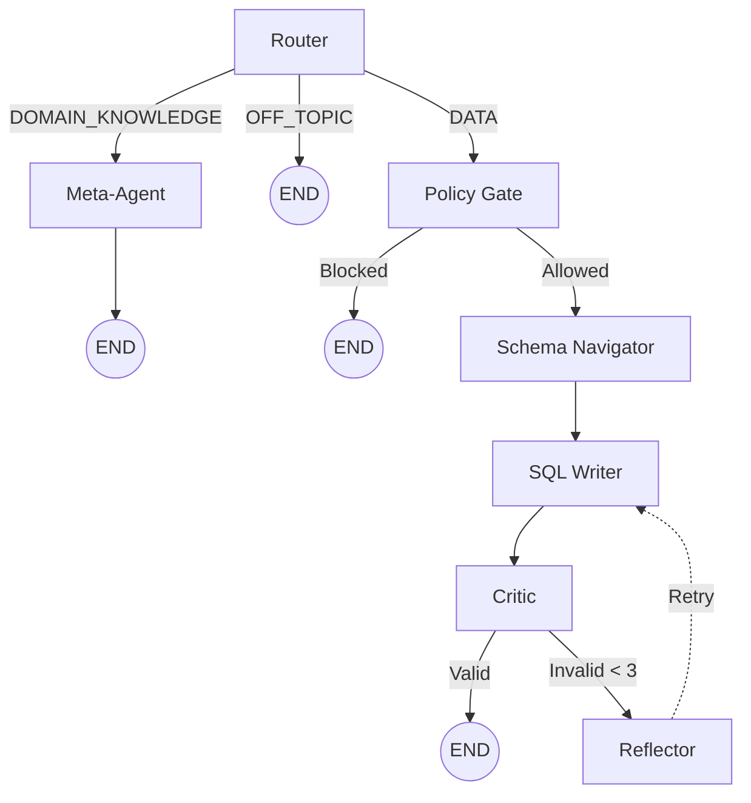
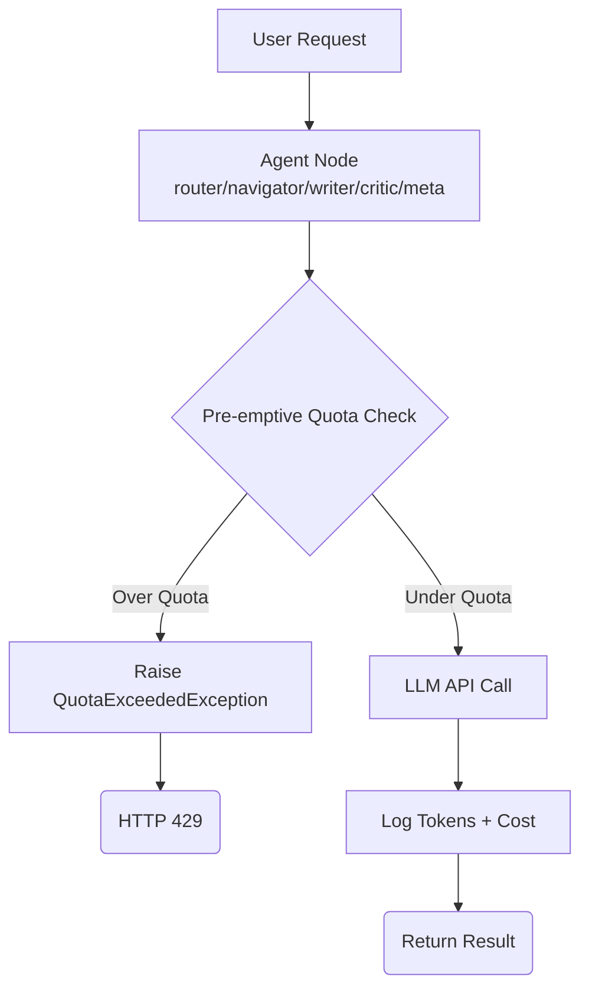

# Architecture & Conventions

## Stack Overview

Benchmarking references:

- Context workflow: `docs/humans/context/BENCHMARKING.md`
- Design framework: `docs/humans/designs/benchmarking_framework.md`

### Backend (TypeScript)

**TypeScript (Active — port 8001)**

- **Framework**: NestJS (Express)
- **AI Orchestration**: `@langchain/langgraph` — multi-agent graph (Router → Schema Navigator → SQL Writer → Critic ↔ Reflector, Meta-Agent)
- **Retrieval**: Prompt-guided schema navigation with heuristic candidate pre-ranking and LLM reranking in `agents/schema-navigator-agent.ts`
- **Memory Policy**: Scoped per-thread memory (`memory-context.ts` + `thread-memory.service.ts`) with confidence decay, TTL invalidation, request-time enable/disable (`enable_memory`), and clear-memory endpoint
- **Database**: PostgreSQL 18.1 (App Data & KPIs)
- **ORM Strategy**:
  - **Drizzle ORM**: Used for PostgreSQL (App Data). Schema and migration ownership lives in `packages/db`.
  - **pg (Raw)**: Used for execution of AI-generated queries on PostgreSQL schema-bound tenant data for maximum flexibility.
- **Logging**: Pino (with file rotation to `../logs/backend.log`)
- **Health**: Standardized `/health` endpoint for Docker and DB connectivity checks.
- **Token Usage**: Push-based SSE (`GET /api/v1/token-usage/events`) replaces polling; `TokenUsageEventsService` emits after every token write.

### Frontend (React 19)

- **Language**: TypeScript (strict mode)
- **Package Manager**: pnpm
- **Styling**: Tailwind CSS v4 with `@theme` directive
- **Color Space**: OKLCH (perceptually uniform)
- **Testing**: Playwright (E2E)

---

## Code Conventions

### Backend

#### Type Safety

All functions must have type hints for arguments and return values:

```typescript
async getUser(userId: number): Promise<User | null> {
  // Retrieve user by ID
}
```

#### Async Operations

Use async/await for all I/O (database, LLM calls, HTTP):

```typescript
async generateSql(prompt: string): Promise<string> {
  const result = await this.llmService.invoke(prompt);
  return result.content;
}
```

#### Configuration

Never use `process.env` directly outside of `ConfigService`. Always use the injected `ConfigService` object:

```typescript
constructor(private configService: ConfigService) {}

// ✅ Correct
const apiKey = this.configService.getGeminiApiKey();

// ❌ Wrong
const apiKey = process.env.GEMINI_API_KEY;
```

#### Logging

Use the built-in `@nestjs/common` `Logger` instead of `console.log`:

```typescript
import { Logger } from "@nestjs/common";

export class AppService {
  private readonly logger = new Logger(AppService.name);

  processRequest(userId: string) {
    this.logger.log(`Processing request for user ${userId}`);
    this.logger.error("Failed to connect", err.stack);
  }
}
```

---

### Frontend

#### CSS Architecture

**@theme Directive** - Define all design tokens in CSS:

```css
@theme {
  --color-primary: oklch(60% 0.2 250);
  --color-bg: oklch(98% 0.01 250);
  --spacing-md: 1rem;
}
```

**Container Queries** - Components adapt to their container, not viewport:

```css
.card {
  @container (min-width: 400px) {
    grid-template-columns: 1fr 1fr;
  }
}
```

**Zero-JS Theme Switching** - Use data attributes:

```tsx
<html data-theme={theme}>
  {/* CSS handles everything via [data-theme="dark"] */}
</html>
```

#### Performance Targets

- **CSS Bundle**: < 10KB
- **Theme Switch**: < 50ms INP
- **First Contentful Paint**: < 1.5s

---

## Project Structure

### Backend (TypeScript - Active)

```
backend/
├── src/
│   ├── app.module.ts          # Root NestJS module
│   ├── main.ts                # Entrypoint (port 8001)
│   ├── app.controller.ts      # GET /api/v1/health
│   ├── ai/
│   │   ├── ai.module.ts
│   │   ├── graph.ts           # LangGraph StateGraph wiring
│   │   ├── state.ts           # GraphState interface
│   │   ├── agents/            # LangGraph Agent Nodes
│   │   │   ├── router-agent.ts        # Intent routing
│   │   │   ├── policy-gate.ts         # Policy enforcement (write-op + unsupported-intent blocking)
│   │   │   ├── schema-navigator-agent.ts  # OMOP table selection
│   │   │   ├── sql-writer-agent.ts    # SQL generation
│   │   │   ├── critic-agent.ts        # SQL validation
│   │   │   ├── reflector-agent.ts     # Reflexion
│   │   │   └── meta-agent.ts          # Domain Q&A
│   │   ├── llm.service.ts     # LLM factory (multi-provider)
│   │   ├── insight.service.ts # Post-query insight generation
│   │   ├── visualization.service.ts
│   │   ├── memory-context.ts  # Scoped memory derivation + summary formatting
│   │   ├── prompt.service.ts
│   │   ├── prompts/           # Agent system prompts
│   │   ├── queries.controller.ts  # POST /queries/query + /queries/stream
│   │   └── config.controller.ts   # GET /config/models
│   ├── auth/
│   │   ├── auth.module.ts
│   │   ├── auth.controller.ts # POST /auth/token|register|guest|logout, GET /auth/me
│   │   ├── auth.service.ts
│   │   └── jwt-auth.guard.ts  # Accepts Bearer header OR ?token= query param
│   ├── config/
│   │   └── config.service.ts  # Zod-validated env config
│   ├── database/
│   │   ├── database.module.ts # PostgreSQL App & Medical Data
│   │   ├── database.service.ts
│   │   └── schema.ts          # App-facing schema exports (source of truth: packages/db)
│   ├── threads/
│   │   ├── threads.controller.ts  # CRUD /threads
│   │   └── threads.service.ts
│   │   └── thread-memory.service.ts # Thread-scoped memory policy store
│   └── token-usage/
│       ├── token-usage.controller.ts  # /token-usage/* + SSE /events
│       ├── token-usage.service.ts
│       ├── token-usage-events.service.ts  # SSE pub/sub per user
│       └── token-usage.module.ts
├── tsconfig.json
├── vitest.config.ts
└── package.json

packages/
└── db/
  ├── src/
  │   ├── schema.ts         # Canonical Drizzle schema for app data
  │   └── migrate.ts        # Compiled migration runtime entrypoint
  ├── drizzle/              # Canonical SQL migration history
  ├── drizzle.config.ts
  └── package.json

data-pipeline/               # OMOP v5.4 Synthea pipeline
├── alembic/                 # Python SQL migrations for OMOP tenant schemas
├── bronze/                  # Raw Synthea data output (Local CSVs)
├── docker-compose.yml       # Transient PostgreSQL 18.3 ETL DB
├── config.py                # Pydantic Settings
├── load_omop.py             # Polars-driven ETL script
├── gold_omop_tenant.sql     # Processed, deployable SQL dump
└── pyproject.toml           # uv Python dependencies (Polars, SQLAlchemy)
```

### Data Pipeline & OMOP Migration

The project utilizes a **Medallion Architecture** to handle high-fidelity clinical data benchmarking:

1.  **Bronze (Raw)**: Synthea generated CSV files (Patients, Encounters, etc.) stored in `data-pipeline/bronze/`. These are ignored by Git.
2.  **Silver (Structured)**: A transient PostgreSQL database where raw data is mapped to the **OMOP CDM v5.4** standard using `load_omop.py` and `Polars`. This layer enforces strict relational data models and standard vocabularies.
3.  **Gold (Curated)**: A portable SQL dump (`gold_omop_tenant.sql`) extracted from the Silver layer. This dump is mounted directly to the production database to allow instantaneous provisioning of tenant clinical data.


### Frontend

```
frontend/
├── src/
│   ├── components/       # React components
│   │   ├── Chat/         # Chat interface components
│   │   ├── Layout/       # Layout components (Sidebar, Header)
│   │   └── Usage/        # Token usage components
│   ├── pages/            # Page-level components
│   │   ├── ChatInterface.tsx
│   │   ├── UsageDashboard.tsx
│   │   └── AdminQuotaManagement.tsx
│   ├── services/         # API client services
│   │   ├── tokenUsageService.ts
│   │   └── api.ts
│   ├── utils/            # Utility functions
│   │   └── auth.ts       # JWT helpers
│   ├── hooks/            # Custom React hooks
│   ├── config/           # Configuration
│   └── App.tsx           # Root component
├── public/               # Static assets
├── package.json          # pnpm dependencies
└── vite.config.ts        # Vite configuration
```

### Documentation

```
docs/
├── README.md             # Main documentation index
├── guides/               # How-to guides
│   ├── GETTING_STARTED.md
│   ├── DEVELOPMENT.md
│   ├── TESTING_GUIDE.md
│   └── ...
├── agents/               # Agent-track docs (concise, policy-focused)
│   ├── context/
│   │   ├── ARCHITECTURE.md   # Hard rules + retrieval + benchmark policy
│   │   ├── CONFIGURATION.md  # Zod/ConfigService rules
│   │   └── WORKFLOWS.md      # Change loop policy
│   └── designs/
│       ├── SYSTEM_DESIGN.md  # Runtime + AI + data design constraints
│       └── EVOLUTION_ROADMAP.md
├── humans/               # Human-track docs (rich, explanatory)
│   ├── context/
│   │   ├── ARCHITECTURE.md   # This file — full stack reference
│   │   ├── CONFIGURATION.md  # Zod patterns + lifecycle
│   │   ├── BENCHMARKING.md   # Benchmark harness detail
│   │   ├── SEMANTIC_RETRIEVAL.md # Retrieval architecture
│   │   └── WORKFLOWS.md      # Engineering change workflow
│   └── designs/          # Deep-dive architecture docs
├── plans/                # Project planning
│   ├── active/           # Current work
│   ├── implemented/      # Completed plans
│   └── backlog/          # Future ideas
└── reports/              # Implementation reports
    ├── current/          # Active reports
    └── archive/          # Historical reports
```

---

## Design Patterns

### Backend: Settings Injection

Use dependency injection for configuration:

```typescript
import { Injectable } from "@nestjs/common";
import { ConfigService } from "./config.service";

@Injectable()
export class LLMService {
  constructor(private configService: ConfigService) {}

  getLlm() {
    if (this.configService.getUseBedrock()) {
      return new BedrockLLM({
        model: this.configService.getBedrockBaseModel(),
      });
    } else if (this.configService.getUseGemini()) {
      return new GeminiLLM({ apiKey: this.configService.getGeminiApiKey() });
    }
  }
}
```

### Frontend: Component Composition

Keep components focused and composable:

```tsx
// ✅ Good - Single responsibility
export const Button = ({ children, onClick }: ButtonProps) => (
  <button onClick={onClick}>{children}</button>
);

// ❌ Bad - Too many concerns
export const ButtonWithModalAndForm = () => { ... };
```

---

## Security Practices

### Backend

- **Never expose raw database errors** to API responses
- **Validate all inputs** with DTOs and Zod schemas
- **Use parameterized queries** (Drizzle handles app-data queries; pg for clinical read queries)
- **Hash passwords** with argon2 (never store plaintext)

### Frontend

- **Sanitize user input** before rendering (React does this automatically)
- **Use environment variables** for API URLs (`VITE_API_URL`)
- **Never commit** API keys to the repository

---

## Database Guidelines

### Migration Workflow (TypeScript)

1. Modify Drizzle schema in `backend/src/database/schema.ts`
2. Generate migration: `pnpm db:generate`
3. Apply migration to production: `pnpm db:migrate`
4. For local dev sync without migration files: `pnpm db:push` (⚠️ choose 'No' when prompted to delete unknown tables or truncate data to preserve cross-backend compatibility).

### Schema Design

- **Read-Only Access**: Application has read-only access to production KPI tables
- **Immutable History**: Never delete historical records; use soft deletes
- **Explicit Indexes**: Add indexes for frequently queried columns

---

## AI Agent Architecture

### LangGraph Multi-Agent Workflow

The system uses a multi-agent workflow orchestrated by LangGraph. The **TypeScript implementation** (`backend/src/ai/`) is the active version.

**Agent Graph (TypeScript — `backend/src/ai/graph.ts`):**



**Execution note:** SQL execution occurs in `queries.controller.ts` after graph completion when `validation_result.valid === true`.

**Mode note:** `fast_mode=true` skips Router LLM classification and caps retries to 1 attempt.

**Agents:**

1. **Router** (`agents/router-agent.ts`): Classifies intent — `DATA`, `DOMAIN_KNOWLEDGE`, or `OFF_TOPIC`
2. **Policy Gate** (`agents/policy-gate.ts`): Blocks write operations and unsupported analytical intents before SQL generation
3. **Schema Navigator** (`agents/schema-navigator-agent.ts`): Selects relevant OMOP tables from available schema
4. **SQL Writer** (`agents/sql-writer-agent.ts`): Generates SQL from question + selected OMOP schema context
5. **Critic** (`agents/critic-agent.ts`): Performs DB syntax validation and semantic critique pass
6. **Reflector** (`agents/reflector-agent.ts`): Adds retry guidance on failures (reflexion loop)
7. **Meta-Agent** (`agents/meta-agent.ts`): Answers domain/OMOP schema questions without SQL

**Current limitations (tracked for improvement):**

- Reflector can still encourage forced SQL generation for unsupported intents.
- Human-in-the-loop approval node is not currently implemented in the active graph.

**Shared State** (`state.ts` — `GraphState` interface):

- `original_query`, `messages`, `generated_sql`, `validation_result`
- `selected_provider?`, `selected_model_override?` — threaded from `POST /queries/stream` body through all nodes
- `thoughts[]`, `reflections[]`, `attempt_count`, `max_attempts`, `fast_mode?`

**Model Selection** (`llm.service.ts` + `config.service.ts`):

```typescript
// Priority: Bedrock > OpenAI > Gemini > Anthropic > Local
const provider = providerOverride || configService.getActiveProvider();
const model = configService.getActiveModelForRole(role, provider);
```

See **[CONFIGURATION.md](CONFIGURATION.md)** for provider env vars.

---

## API Endpoint Reference

All 20 endpoints are implemented in NestJS (`backend`). The Vite dev proxy routes all `/api/*` to port 8001.

| Method | Path                                        | Controller             | Auth            |
| ------ | ------------------------------------------- | ---------------------- | --------------- |
| GET    | `/api/v1/health`                            | `AppController`        | Public          |
| POST   | `/api/v1/auth/token`                        | `AuthController`       | Public          |
| POST   | `/api/v1/auth/register`                     | `AuthController`       | Public          |
| POST   | `/api/v1/auth/guest`                        | `AuthController`       | Public          |
| POST   | `/api/v1/auth/logout`                       | `AuthController`       | JWT             |
| GET    | `/api/v1/auth/me`                           | `AuthController`       | JWT             |
| GET    | `/api/v1/threads`                           | `ThreadsController`    | JWT             |
| POST   | `/api/v1/threads`                           | `ThreadsController`    | JWT             |
| GET    | `/api/v1/threads/:id/messages`              | `ThreadsController`    | JWT             |
| DELETE | `/api/v1/threads/:id`                       | `ThreadsController`    | JWT             |
| PATCH  | `/api/v1/threads/:id`                       | `ThreadsController`    | JWT             |
| POST   | `/api/v1/queries/query`                     | `QueriesController`    | JWT             |
| POST   | `/api/v1/queries/stream`                    | `QueriesController`    | JWT             |
| GET    | `/api/v1/config/models`                     | `ConfigController`     | JWT             |
| GET    | `/api/v1/token-usage`                       | `TokenUsageController` | JWT             |
| GET    | `/api/v1/token-usage/monthly`               | `TokenUsageController` | JWT             |
| GET    | `/api/v1/token-usage/monthly/breakdown`     | `TokenUsageController` | JWT             |
| GET    | `/api/v1/token-usage/status`                | `TokenUsageController` | JWT             |
| GET    | `/api/v1/token-usage/events`                | `TokenUsageController` | JWT (`?token=`) |
| GET    | `/api/v1/token-usage/admin/users`           | `TokenUsageController` | JWT + Admin     |
| PUT    | `/api/v1/token-usage/admin/users/:id/quota` | `TokenUsageController` | JWT + Admin     |

> **SSE note**: `GET /token-usage/events` accepts `?token=<jwt>` as a query parameter because browser `EventSource` cannot set request headers.

---

## Token Tracking & Quota System

### Architecture

The token tracking system monitors LLM API usage and enforces monthly quotas in the TypeScript backend:

**Components:**

1. **Token Usage Service** (`backend/src/token-usage/token-usage.service.ts`)
   - Pre-emptive quota checks before LLM calls
   - Post-call token logging with cost calculation
   - Monthly usage aggregation

2. **Database Layer** (`backend/src/database/schema.ts` + Drizzle migrations)
   - `token_usage` table: Records each LLM call
   - `users` table: Stores monthly token limits

3. **API Endpoints** (`backend/src/token-usage/token-usage.controller.ts`)
   - User endpoints: View usage, monthly breakdown
   - Admin endpoints: Manage quotas, view all users

4. **SSE Events Service** (`backend/src/token-usage/token-usage-events.service.ts`)

- Pushes token updates to connected clients
- Powers real-time usage indicators

5. **Frontend Integration** (`frontend/src/components/Usage/`)
   - Usage indicator in header (auto-refresh)
   - Usage dashboard with historical charts
   - Admin quota management interface

### Quota Enforcement Flow



**Error Handling:**

- Non-streaming endpoints: HTTP 429 status code
- Streaming endpoints: Yield error event in SSE stream
- Frontend: Display user-friendly error message

See **[designs/frontend_architecture.md](../designs/frontend_architecture.md)** for detailed frontend architecture.
