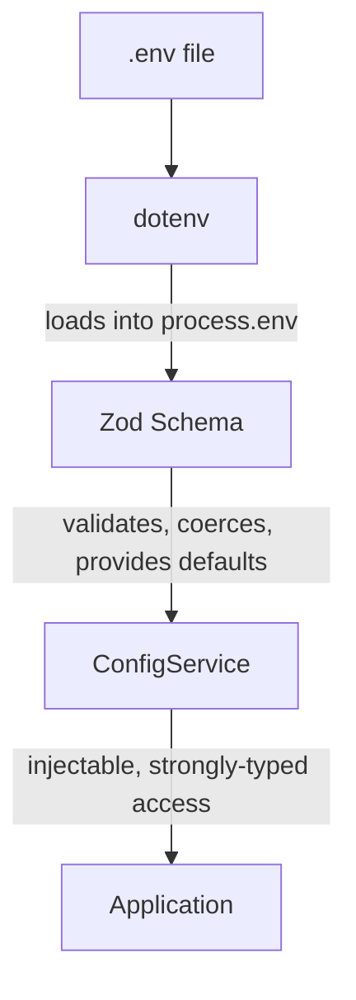

# Configuration & Security

## Configuration Architecture

**Single Source of Truth**: `backend/src/config/env.config.ts` (Zod) and `ConfigService`

All backend configuration is managed through Zod schemas and NestJS injection, which:

1. Loads `.env` file automatically via dotenv
2. Validates types and provides typed defaults via Zod
3. Exposes strongly typed configurations across the codebase via `ConfigService`

---

```typescript
// backend/src/config/env.config.ts
import { z } from "zod";
import * as dotenv from "dotenv";

dotenv.config({ path: "../.env" }); // Load from project root

export const EnvSchema = z.object({
  NODE_ENV: z
    .enum(["development", "production", "test"])
    .default("development"),
  DB_HOST: z.string().default("localhost"),
  DB_PORT: z.coerce.number().default(5432),
  GEMINI_API_KEY: z.string().optional(),
  USE_BEDROCK: z.coerce.boolean().default(false),
  // ...
});

export const config = EnvSchema.parse(process.env);
export type AppConfig = z.infer<typeof EnvSchema>;

// backend/src/config/config.service.ts
import { Injectable } from "@nestjs/common";
import { config, AppConfig } from "./env.config";

@Injectable()
export class ConfigService {
  get<K extends keyof AppConfig>(key: K): AppConfig[K] {
    return config[key];
  }
}
```



---

## Usage Rules

### ✅ CORRECT

```typescript
import { Injectable } from "@nestjs/common";
import { ConfigService } from "./config.service";

@Injectable()
export class AIOrchestrator {
  constructor(private config: ConfigService) {}

  process() {
    // Type-safe, validated access
    const dbHost = this.config.get("DB_HOST");
    const geminiKey = this.config.get("GEMINI_API_KEY");

    // Conditional logic based on validated config
    if (this.config.get("USE_BEDROCK")) {
      // Initialize Bedrock client
    }
  }
}
```

### ❌ WRONG

```typescript
// DON'T DO THIS - bypasses validation, no type safety
const apiKey = process.env.GEMINI_API_KEY;
const dbHost = process.env.DB_HOST || "localhost";
```

### Critical Guidelines

1. **NEVER use `process.env` directly in application logic**. Always utilize the injected `ConfigService`.
2. **Dependency Isolation**: Code paths must respect feature flags (e.g., `this.config.get('USE_BEDROCK')`).
3. **Graceful Fallbacks**: Missing optional keys should have sensible defaults defined the Zod schema.
4. **ASK FIRST** before adding new variables to the environment.

---

## Legacy Mode (Python) Compatibility

In the legacy Python backend, Pydantic settings are synced directly to `os.environ` so `boto3` can interact directly without complaining about missing IMDS configurations (`AWS_EC2_METADATA_DISABLED`). In the new nestjs setup, we interact with LangChain.js which relies heavily on standard exported envs out-of-the-box making explicit syncs to the environment less necessary than with traditional boto3 code.

---

## Database Security

- **Read-Only Access**: Agents have Read-Only access to production KPI tables.
- **NEVER** modify the DB schema manually. Always use Drizzle migrations (or Alembic for legacy).
- **NEVER** commit the raw `init.sql` dump if it contains real-world data.

---

DatabaseURL string building is handled seamlessly by Drizzle or custom query providers rather than being hardcoded.

```typescript
import { drizzle } from "drizzle-orm/node-postgres";
import { Pool } from "pg";
import { ConfigService } from "../config/config.service";

const config = new ConfigService();

const pool = new Pool({
  host: config.get("POSTGRES_HOST"),
  port: config.get("POSTGRES_PORT"),
  user: config.get("POSTGRES_USER"),
  password: config.get("POSTGRES_PASSWORD"),
  database: config.get("POSTGRES_DB"),
});

export const db = drizzle(pool);
```
