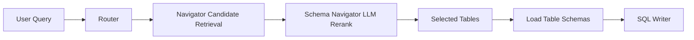

# Semantic Retrieval Guide

This document describes the active retrieval implementation in the TypeScript backend and how it reduces token usage while preserving relevance.

For benchmark execution and metrics interpretation, see `docs/context/BENCHMARKING.md`.

## Current State (Implemented)

`schema-navigator.ts` now uses **hybrid candidate retrieval + LLM reranking**:

- Prompt guidance from `backend/src/ai/prompts/system_prompts.yaml`
- Schema metadata from `backend/src/ai/prompts/semantic_view.yaml`
- Runtime table discovery from `DatabaseService.getAllTableNames()`
- Candidate pre-ranking (`retrieveCandidateTables`) before final LLM selection

At query time, the workflow is:

## Memory-aware Context Policy

Follow-up context is now handled through scoped memory instead of transcript replay:

- Thread memory stores normalized facts (`active_patients`, timeframe, KPI intent, units)
- SQL writer receives compact `SCOPED CONVERSATION MEMORY`
- Memory confidence decays over time; TTL and low-confidence invalidation remove stale state
- Users can disable memory per request (`enable_memory=false`) or clear all memory via `DELETE /api/v1/memory`

This keeps continuity while avoiding token waste from hardcoded last-N conversation injection.

## Why This Matters

Table selection is the main token-efficiency lever:

- Better selection reduces schema context sent to SQL Writer
- Smaller context improves latency and lowers LLM cost
- Cleaner selection reduces hallucinated joins and retry loops

## Source of Truth

Use these artifacts together:

- `data-pipeline/gold_omop_tenant.sql` → OMOP tenant + vocab PostgreSQL bootstrap reality
- `backend/src/ai/prompts/semantic_view.yaml` → retrieval metadata + join graph + unsupported intents
- `backend/src/ai/prompts/system_prompts.yaml` → navigator/writer/critic/reflector behavior contracts

## Remaining Evolution

### Retrieval hardening next

1. Add route-level policy guardrails before SQL generation
2. Expand unsupported-intent precision with stricter policy gates
3. Benchmark retrieval/token/latency trends across rollout cohorts

## Success Metrics

Track before/after by mode and provider:

- Navigator tokens per request
- SQL Writer prompt tokens per request
- End-to-end latency p50/p95
- First-pass SQL validation rate
- Average reflection loop count
- Unsupported-intent precision (correctly declined requests)

## References

- [Architecture](ARCHITECTURE.md)
- [Multi-Agent Design](../designs/multi_agent_architecture.md)
- [Semantic View](../../backend/src/ai/prompts/semantic_view.yaml)
- [System Prompts](../../backend/src/ai/prompts/system_prompts.yaml)
