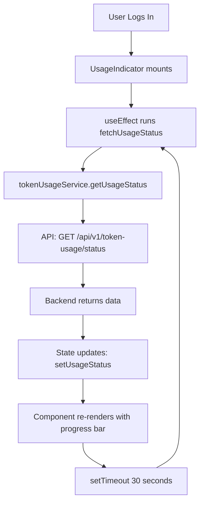
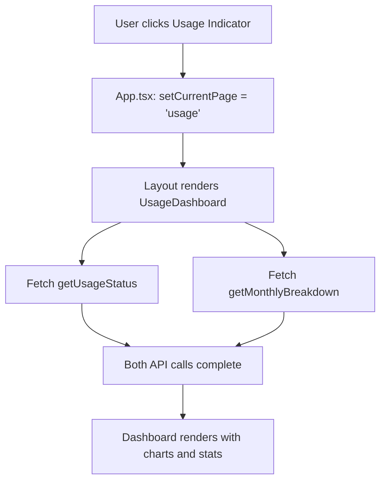
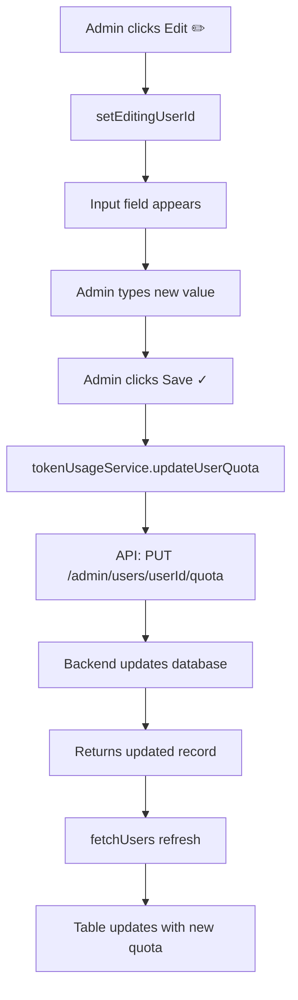
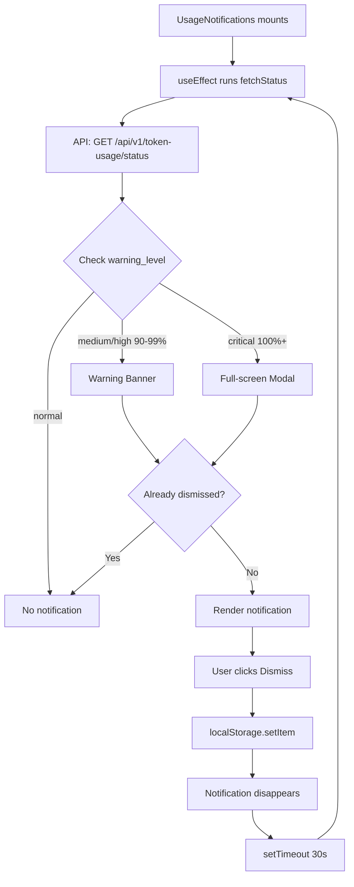
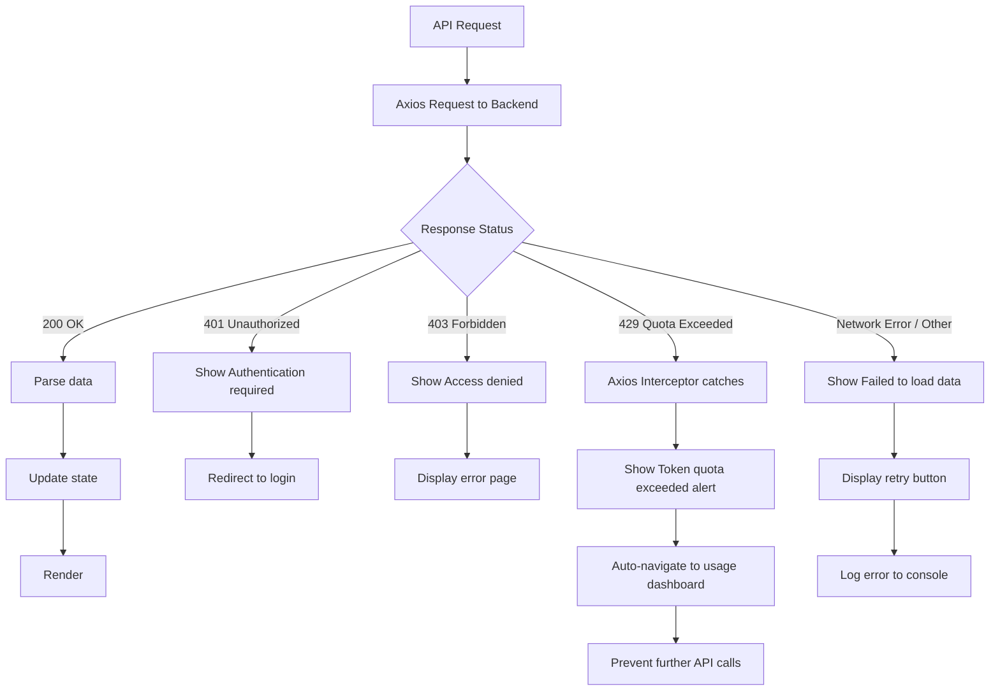

# Frontend Architecture

## Overview

This document describes the architecture of the Mediquery frontend, including component hierarchy, data flow patterns, state management, and integration with backend services.

## Component Hierarchy

```
App.tsx (Root)
├── UsageNotifications (Global Notifications)
│   ├── Warning Banner (90-99%)
│   └── Critical Modal (100%+)
│
└── Layout (Main Container)
    ├── Sidebar
    │   ├── New Chat Button
    │   ├── Thread List
    │   ├── Usage Dashboard Link ← NEW
    │   ├── Quota Management Link ← NEW (admin)
    │   └── Settings Menu
    │       ├── Appearance theme selector
    │       └── Thread Memory toggle (shadcn Switch)
    │
    └── Main Content Area
        ├── Header Bar ← NEW
        │   └── UsageIndicator (Always Visible)
        │       ├── Icon + Usage Text
        │       ├── Progress Bar
        │       └── Hover Tooltip
        │
        └── Page Content (Conditional)
            ├── ChatInterface (default)
            │   ├── Message List
            │   └── Input Bar
            │
            ├── UsageDashboard ← NEW
            │   ├── Warning Banner
            │   ├── Current Month Card
            │   ├── Historical Chart
            │   └── Info Section
            │
            └── AdminQuotaManagement ← NEW
                ├── Overview Stats
                ├── Search Input
                └── User Table
```

## Data Flow

### Usage Indicator Auto-Refresh


### Navigation Flow


### Admin Quota Update


### Warning Notification Flow


## API Service Architecture

```typescript
tokenUsageService
├── getCurrentUsage()
│   → GET /api/v1/token-usage
│   → Returns: TokenUsage
│
├── getMonthlyBreakdown()
│   → GET /api/v1/token-usage/monthly
│   → Returns: MonthlyBreakdown { current, history[] }
│
├── getUsageStatus()
│   → GET /api/v1/token-usage/status
│   → Returns: UsageStatus { percentage, warning_level, ... }
│
├── getAdminUsers()
│   → GET /api/v1/token-usage/admin/users
│   → Returns: AdminUsersResponse { users[], total_users }
│   → Auth: Admin required (403 if not)
│
└── updateUserQuota(userId, { tokens_limit })
    → PUT /api/v1/token-usage/admin/users/{userId}/quota
    → Returns: Updated TokenUsage
    → Auth: Admin required (403 if not)
```

## State Management

```typescript
App.tsx State:
├── currentPage: 'chat' | 'usage' | 'admin-quota'  ← Navigation
├── token: string | null                            ← JWT auth
├── user: string | null                             ← Username
├── threads: Thread[]                               ← Chat threads
├── messages: Message[]                             ← Chat history
├── theme: Theme                                    ← UI theme
├── agentMode: AgentMode                            ← AI mode
└── enable_memory: boolean                          ← Thread memory toggle

UsageIndicator State:
├── usageStatus: UsageStatus | null                 ← Current usage
├── loading: boolean                                ← Loading state
├── error: string | null                            ← Error message
└── showTooltip: boolean                            ← Hover state

UsageDashboard State:
├── usageStatus: UsageStatus | null                 ← Current usage
├── monthlyData: MonthlyBreakdown | null            ← History
├── loading: boolean                                ← Initial load
├── refreshing: boolean                             ← Refresh state
└── error: string | null                            ← Error message

AdminQuotaManagement State:
├── users: AdminUser[]                              ← All users
├── filteredUsers: AdminUser[]                      ← Search results
├── searchTerm: string                              ← Search input
├── sortBy: 'username' | 'percentage'               ← Sort column
├── sortOrder: 'asc' | 'desc'                       ← Sort direction
├── editingUserId: string | null                    ← Edit mode
├── editValue: string                               ← Edit input
├── loading: boolean                                ← Initial load
├── refreshing: boolean                             ← Refresh state
├── saving: boolean                                 ← Save state
└── error: string | null                            ← Error message

UsageNotifications State:
├── usageStatus: UsageStatus | null                 ← Current usage
└── dismissed: Set<string>                          ← Dismissed IDs
```

## Error Handling Flow



## Query Payload Settings

The frontend sends user settings with each query request to the backend.

```typescript
POST /api/v1/queries/stream
{
  question,
  thread_id,
  model_id,
  model_provider,
  fast_mode,
  multi_agent,
  enable_memory
}
```

- `enable_memory=true` → memory is used when deriving scoped context
- `enable_memory=false` → memory is skipped for the request

This keeps memory policy explicit and user-controlled from Settings.

## Color Coding System

```
Warning Level → Usage Range → Color → CSS Class

Normal    →  0-79%  → 🟢 Green  → bg-green-500
Medium    → 80-89%  → 🟡 Yellow → bg-yellow-500
High      → 90-94%  → 🟠 Orange → bg-orange-500
Critical  → 95-100% → 🔴 Red    → bg-red-500
```

Applied to:
- Progress bars (UsageIndicator, Dashboard, Admin table)
- Status badges (Admin table)
- Warning banners (Dashboard, Notifications)
- Text colors (percentage displays)

## TypeScript Interfaces

```typescript
// Token Usage Data
interface TokenUsage {
  user_id: string;
  period: string;        // "2026-01"
  tokens_used: number;
  tokens_limit: number;
  reset_date: string;    // ISO date
}

// Monthly Usage Record
interface MonthlyUsage {
  period: string;        // "2026-01"
  tokens_used: number;
  tokens_limit: number;
  percentage: number;    // 0-100
}

// Historical Breakdown
interface MonthlyBreakdown {
  current: MonthlyUsage;
  history: MonthlyUsage[];  // Last 6 months
}

// Usage Status with Warning Level
interface UsageStatus {
  tokens_used: number;
  tokens_limit: number;
  percentage: number;
  warning_level: 'normal' | 'medium' | 'high' | 'critical';
  message: string;
  reset_date: string;
}

// Admin User Record
interface AdminUser {
  user_id: string;
  username: string;
  tokens_used: number;
  tokens_limit: number;
  percentage: number;
  warning_level: 'normal' | 'medium' | 'high' | 'critical';
}

// Admin Users Response
interface AdminUsersResponse {
  users: AdminUser[];
  total_users: number;
}

// Quota Update Payload
interface QuotaUpdate {
  tokens_limit: number;
}
```

## CSS Variables Used

```css
/* Background Colors */
--bg-primary         /* Main background */
--bg-secondary       /* Card backgrounds */
--bg-tertiary        /* Hover states */

/* Text Colors */
--text-primary       /* Main text */
--text-secondary     /* Secondary text */
--text-tertiary      /* Tertiary text */

/* Border Colors */
--border-subtle      /* Card borders */

/* Accent Colors */
--accent-primary     /* Brand color */
--accent-hover       /* Hover state */

/* Status Colors (Tailwind) */
bg-green-500         /* Normal */
bg-yellow-500        /* Medium */
bg-orange-500        /* High */
bg-red-500           /* Critical */
```

## Responsive Breakpoints

```css
/* Tailwind default breakpoints */
sm:  640px  /* Small devices */
md:  768px  /* Medium devices */
lg:  1024px /* Large devices */
xl:  1280px /* Extra large devices */

/* Usage in components */
- Dashboard: Grid switches from 1 to 3 columns at md
- Admin table: Horizontal scroll on small screens
- Sidebar: Collapses to icons-only on toggle
- Header: Usage indicator always visible
```

## Performance Optimizations

```
1. Auto-refresh Interval: 30 seconds (not too aggressive)
2. Conditional Rendering: Only render active page
3. Lazy State Updates: setState only when data changes
4. Efficient Filters: Client-side search/sort (no re-fetch)
5. Error Boundaries: Prevent full app crashes
6. Loading States: Show skeletons, prevent layout shift
```

## Accessibility Features

```
1. Semantic HTML: <button>, <table>, <main>, <header>
2. ARIA Labels: title attributes on icons
3. Keyboard Navigation: All interactive elements focusable
4. Color Contrast: Meets WCAG AA standards
5. Screen Reader: Descriptive text for all actions
6. Focus Indicators: Visible outline on focus
```

## Security Considerations

```
1. JWT Authentication: Bearer token in Authorization header
2. Role-based Access: Admin routes check 403 response
3. Input Validation: Number parsing for quota inputs
4. XSS Prevention: React escapes all user input
5. CSRF Protection: Backend uses same-origin policy
6. Error Messages: Generic errors (no sensitive info)
```

---

**Last Updated**: February 1, 2026  
**Status**: ✅ Implementation Complete
