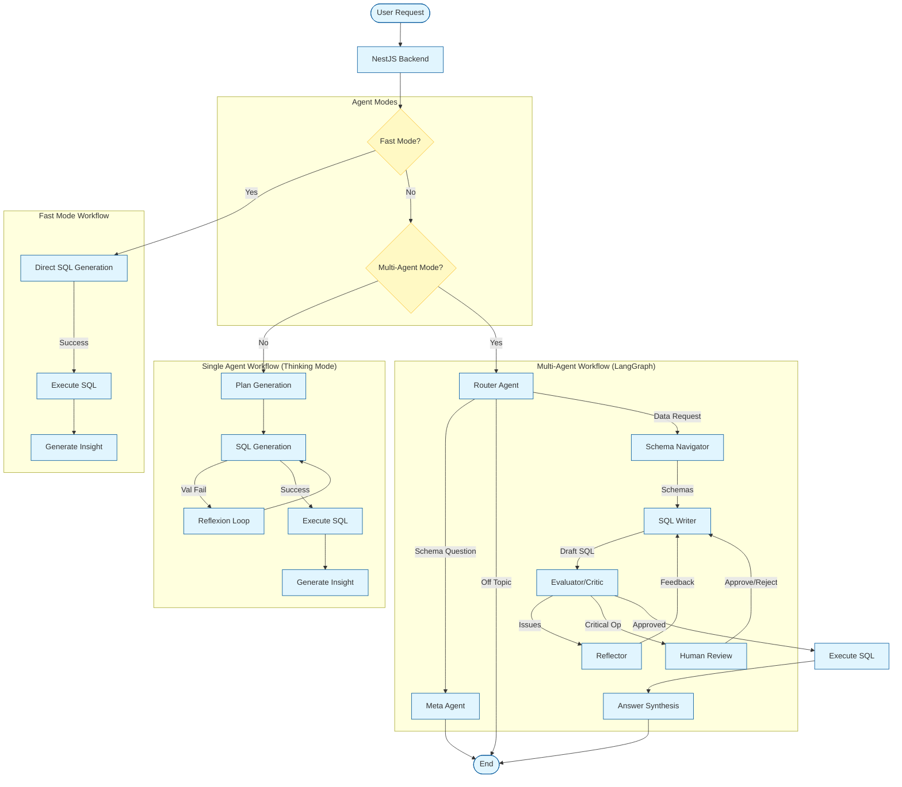

# Mediquery Multi-Agent Architecture

## 🧭 Overview

Mediquery uses a Tiered Agent Architecture to handle user requests, ranging from simple single-shot queries to complex multi-step reasoning tasks. The system automatically routes requests based on complexity settings (Agent Mode) and query intent.

## ✅ Current Implementation Snapshot (TypeScript Backend)

The active graph in `backend/src/ai/graph.ts` currently implements:

- `Router` → (`DOMAIN_KNOWLEDGE` → `Meta-Agent`) OR (`DATA` → `Schema Navigator` → `SQL Writer` → `Critic` ↔ `Reflector`) OR (`OFF_TOPIC` → end)
- `fast_mode=true` bypasses Router LLM classification and limits retries to one attempt
- SQL execution occurs after graph completion in `queries.controller.ts` when critic validation is successful

The sections below include both current and target/aspirational patterns.

## 🏗️ Architecture Diagram



## 🔄 Scenarios & Workflows

### 1. ⚡ Fast Mode (Single-Shot)

**Usage**: Simple, low-latency lookups.
**Flow**: `User -> LLM (Direct SQL) -> DB -> Insight`

- **Pros**: Fastest response time (< 2s).
- **Cons**: No self-correction, prone to hallucinations on complex schemas.
- **Enabled By**: Toggling "Fast Mode" UI switch.

### 2. 🧠 Thinking Mode (Single-Agent Standard)

**Usage**: Default mode. Balanced reliability and speed.
**Flow**:

1. **Plan**: LLM generates a 3-step execution plan.
2. **Generate**: LLM writes SQL.
3. **Reflexion**: If SQL fails validation, LLM self-corrects (up to 3 retries).
4. **Execute**: Run validated SQL.
5. **Insight**: Summarize results.

- **Pros**: High reliability for standard KPI queries.
- **Cons**: Linear process, limited to one LLM context.

### 3. 🤖 Multi-Agent Mode (LangGraph)

**Usage**: Complex, multi-hop, or ambiguous queries requiring exploration.
**Architecture**:

- **Router**: Classifies intent (Data vs. Schema vs. Chat).
- **Schema Navigator**: Selects relevant tables from the available MySQL KPI schema.
- **SQL Writer**: Specialized expert for recursive CTEs and complex joins.
- **Critic**: Seperate LLM (often different provider) validates logic.
- **Reflector**: Feeds error analysis back to Writer.
- **Human-in-the-Loop**: target capability for sensitive operations (not yet wired in active graph).

## ⚠️ Known Gaps (Current vs Target)

- Reflector guidance should prefer explicit unsupported-intent exits over forcing approximate SQL.
- Semantic retrieval is prompt-driven today; vector retrieval/reranking is a planned enhancement.

## 🧠 Scoped Thread Memory

Memory is now handled as an explicit policy layer, not a raw transcript dump into every prompt.

### Runtime Behavior

- Memory is derived from recent user messages, summarized, and persisted per thread.
- Stored memory fields: `active_patients`, `active_timeframe`, `active_kpi_intent`, `preferred_units`, `summary`, `confidence`, `updated_at`, `expires_at`.
- Memory confidence decays over time; low-confidence or expired memory is invalidated automatically.
- Users can enable or disable memory in Settings (`enable_memory` in request payload), and clear all memory via `DELETE /api/v1/memory`.

### Prompt Injection Strategy

- SQL Writer receives compact, structured memory context (`SCOPED CONVERSATION MEMORY`) instead of full multi-turn transcript replay.
- UI thought stream shows a human-readable memory summary (e.g., KPI/timeframe/units + confidence) for transparency.

### Why this replaces hardcoded history replay

- Avoids token waste from replaying arbitrary last-N conversation messages.
- Preserves follow-up continuity through normalized memory facts.
- Keeps context bounded and explainable.

## 🧩 Component Details

### Agents

| Agent         | Role              | Tools          | Model                |
| ------------- | ----------------- | -------------- | -------------------- |
| **Router**    | Intent Classifier | None           | Fast (Haiku/Flash)   |
| **Navigator** | Schema Explorer   | Vector Search  | Fast (Haiku/Flash)   |
| **Writer**    | Code Generator    | Schema Context | Strong (Sonnet/Pro)  |
| **Critic**    | QA Engineer       | SQL Validator  | Diverse (GPT-4/Opus) |

### State Management

The `AgentState` object persists across steps, tracking:

- `original_query`: User input
- `query_plan`: Generated strategy
- `data_schema`: Selected table definitions
- `generated_sql`: Current draft
- `reflections`: History of errors and fixes
- `human_feedback`: User inputs during interrupts

## 🛠️ Configuration

Enable Multi-Agent mode via `.env` or UI toggle:

```bash
# Backend Default
AGENT_MODE=thinking
ENABLE_HUMAN_INTERRUPTS=true
```
